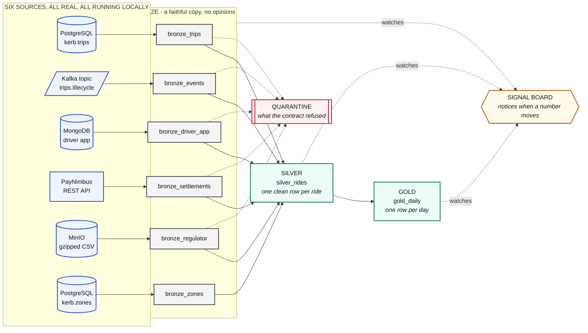
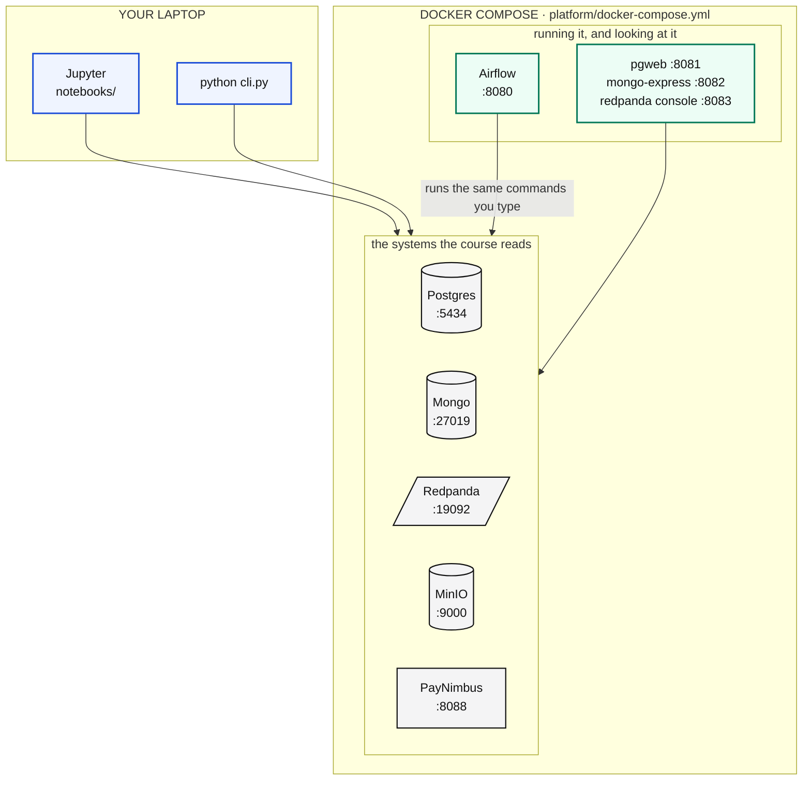

<div align="center">

# NIGHTSHIFT

### Learn data engineering by building a real warehouse, from six real sources, on your own laptop

[](https://www.python.org)
[](https://www.postgresql.org)
[](https://redpanda.com)
[](https://www.mongodb.com)
[](https://min.io)
[](https://airflow.apache.org)
[](https://www.docker.com)

**Twelve notebooks. Eight pipelines. Six sources. One command to set it all up.**

[Quick start](#quick-start) · [What you build](#what-you-build) · [The notebooks](#the-twelve-notebooks) · [The estate](#the-estate) · [Commands](#commands) · [Docs](docs/)

</div>

---

## What this is

KERB is a ride hailing company. Its data lives in six different systems that
disagree with each other, because that is what real data does.

You are going to copy all six into a warehouse, join them into one clean table,
aggregate that into the answer finance actually asks for, and build the thing
that notices when a number stops making sense. Then you are going to break it on
purpose and find the break.

Everything runs on your laptop. Nothing is a simulation, nothing is mocked, and
there is a reset button that always works.



---

## Quick start

You need **Docker Desktop** and **Python 3.11 or newer**. Nothing else.

> **Give Docker at least 6 GB of memory.** Docker Desktop, Settings, Resources,
> Memory. The estate runs nine containers and Airflow alone wants 1.5 GB. This
> is the single most common reason a first run fails.

### 1. Get the code and the Python side ready

```bash
git clone https://github.com/fnusatvik07/nightshift-build.git
cd nightshift-build

python3 -m venv .venv
source .venv/bin/activate          # Windows: .venv\Scripts\activate
pip install -r requirements.txt
```

### 2. Copy the settings file

```bash
cp .env.example .env
```

No editing needed. The defaults match the containers. Only change a port if
something on your machine already uses it.

### 3. Start the estate

```bash
docker compose -f platform/docker-compose.yml up -d
```

First time, this pulls about 2 GB of images and builds two of them, so it takes
a few minutes. After that it is seconds.

Wait until everything reports healthy:

```bash
docker compose -f platform/docker-compose.yml ps
```

### 4. Fill it with data

```bash
python -m seed
```

About 40 seconds. It generates a month of trading, roughly 360,000 rides, and
writes the consequences of those rides into all six systems: the app database,
the event stream, the document store, the processor's ledger, the object store,
and the reference tables.

In a hurry? `python -m seed --quick` gives you 7 days instead of 30.

### 5. Check it, then run everything

```bash
python cli.py status         # what exists right now
python cli.py run all        # all eight pipelines, about 35 seconds
python cli.py board          # the signal board
```

If that last command prints six signals, you are done. Open the notebooks:

```bash
jupyter lab notebooks/
```

<details>
<summary><b>Using Claude Code?</b> There is a file for that.</summary>

<br>

This repo ships a [`CLAUDE.md`](CLAUDE.md) written to be executed rather than
read. Open the repo in Claude Code and say:

> Set up this project locally for me.

It will check your prerequisites, start the containers, wait for them properly,
seed the data, run the pipelines, verify the result, and tell you what to open.
If something fails it knows the usual causes.

</details>

---

## What you build

| Layer | Table | Grain | What it is for |
|---|---|---|---|
| **Bronze** | `bronze_trips` | one row per ride | a faithful copy of the app database |
| | `bronze_events` | one row per event | the ride lifecycle, off the stream |
| | `bronze_driver_app` | one row per app event | nested documents, flattened |
| | `bronze_settlements` | one row per settlement | what the processor told us |
| | `bronze_regulator` | one row per audited ride | the regulator's nightly file |
| | `bronze_zones` | one row per zone | a dimension, replaced whole |
| **Silver** | `silver_rides` | one row per ride | all six joined, units fixed, ids resolved |
| **Gold** | `gold_daily` | one row per day | the answer finance asks for |
| **Always** | `runs` | one row per pipeline run | did it run, how long, how many rows |
| | `quarantine` | one row per held record | what was refused, and why |

Everything lands in one Postgres schema called `teach`, which is created by the
pipelines and can be dropped at any moment with `python cli.py reset`.

---

## The twelve notebooks

Run them in order. Each one is standalone, and each one ends with something on
the screen that was not there before.

| # | Notebook | You learn |
|---|---|---|
| 1 | **What a pipeline actually is** | why a warehouse exists, and the words |
| 2 | **Bronze, from a database** | windows, contracts, delete-then-insert in one transaction |
| 3 | **Bronze, from a stream** | consumer groups, at-least-once, commit after the write |
| 4 | **Bronze, from documents** | nested paths, a field that moved, why zero is not unknown |
| 5 | **Bronze, from an API** | three outcomes not two, batching, timeouts |
| 6 | **Bronze, from files and a dimension** | no types in a CSV, no file versus empty file, facts versus dimensions |
| 7 | **Silver, joining it together** | `LEFT` versus `INNER` as silent data loss, `ON` versus `WHERE` |
| 8 | **Gold and the signal board** | aggregation, and the three kinds of checkpoint |
| 9 | **Break it and put it back** | the failure where nothing fails, and how to find it |
| 10 | **Kafka from scratch** | brokers, topics, partitions, offsets, groups, lag, built up from nothing |
| 11 | **MongoDB, live** | insert a document, move a field, watch the contract deal with it |
| 12 | **Scheduling with Airflow** | write a DAG, deploy it, watch a schedule fire by itself |

Every notebook holds **runnable code in its cells**, not descriptions of code
that lives elsewhere. You run a cell, you see the output, you explain it.

---

## The estate

Nine containers. All of them optional to understand, none of them optional to
run.

| Service | URL | Login | What it is |
|---|---|---|---|
| **Postgres** | `localhost:5434` | `kerb` / `kerb_local_dev` | the app database, and the warehouse |
| **MongoDB** | `localhost:27019` | `kerb` / `kerb_local_dev` | the driver app's documents |
| **Redpanda** | `localhost:19092` | none | the event stream, Kafka compatible |
| **MinIO** | [localhost:9001](http://localhost:9001) | `kerbadmin` / `kerb_local_dev` | object storage, S3 compatible |
| **PayNimbus** | [localhost:8088/docs](http://localhost:8088/docs) | none | the payment processor's API |
| **Airflow** | [localhost:8080](http://localhost:8080) | `kerb` / `kerb_local_dev` | the orchestrator |
| **pgweb** | [localhost:8081](http://localhost:8081) | none | browse Postgres |
| **Mongo Express** | [localhost:8082](http://localhost:8082) | none | browse MongoDB |
| **Redpanda Console** | [localhost:8083](http://localhost:8083) | none | browse the stream |

These credentials are local development defaults, hardcoded in
`platform/docker-compose.yml` and printed here on purpose. Nothing here should
ever be exposed to a network you do not own.



---

## Commands

```bash
python cli.py status         # what exists right now, and what ran last
python cli.py run all        # every pipeline, in dependency order
python cli.py run p1_bronze_trips
python cli.py board          # the signal board, in the terminal
python cli.py dashboard      # the signal board, in a browser at :8099
python cli.py deploy         # make Airflow re-read the DAGs, now
python cli.py break          # move a field upstream, on purpose
python cli.py fix            # put it back
python cli.py reset          # drop the warehouse and start again
```

```bash
python -m seed               # 30 days of trading
python -m seed --quick       # 7 days, for a fast first run
python -m seed --force       # wipe what is there and generate it again
```

**`reset` is the one that matters.** It drops the `teach` schema and forgets the
stream position, and it never touches a source system. Nothing you do in this
course can leave the estate in a state you cannot get out of, which is what
makes it safe to break things on purpose in notebook 9.

---

## Repo layout

```
nightshift/
├── notebooks/          the twelve lessons, in order
├── pipelines/          the eight pipelines, one file each
│   └── lib/            the four rules, written once
│       ├── config.py   every address in the system, in one file
│       └── run.py      the run log, quarantine, and write_window
├── signals/            the board that notices when a number moves
├── seed/               generates the world all six systems describe
├── platform/           docker compose, the database schemas, the partner API
├── airflow/dags/       the DAG. This folder IS the deployment
├── diagrams/           the drawio sources for the notebook diagrams
├── docs/               the long form explanations
├── cli.py              one command for everything
└── CLAUDE.md           setup instructions, written to be executed
```

---

## Documentation

| Document | What is in it |
|---|---|
| [docs/setup.md](docs/setup.md) | installing it, in detail, with every failure we have seen |
| [docs/architecture.md](docs/architecture.md) | the estate, the flow, and why it is shaped this way |
| [docs/pipelines.md](docs/pipelines.md) | the eight pipelines, one section each |
| [docs/medallion.md](docs/medallion.md) | bronze, silver, gold, and what each layer may do |
| [docs/contracts.md](docs/contracts.md) | contracts, quarantine, and the three checkpoints |
| [docs/signals.md](docs/signals.md) | what a signal is, and what makes a useless one |
| [docs/orchestration.md](docs/orchestration.md) | Airflow, DAGs, and what an orchestrator does not do |
| [docs/data.md](docs/data.md) | the data dictionary, and the incidents hidden in the seed |
| [docs/teaching.md](docs/teaching.md) | running this as a class, session by session |
| [docs/troubleshooting.md](docs/troubleshooting.md) | when it does not work |

---

## Licence

MIT. Use it, teach with it, change it.
